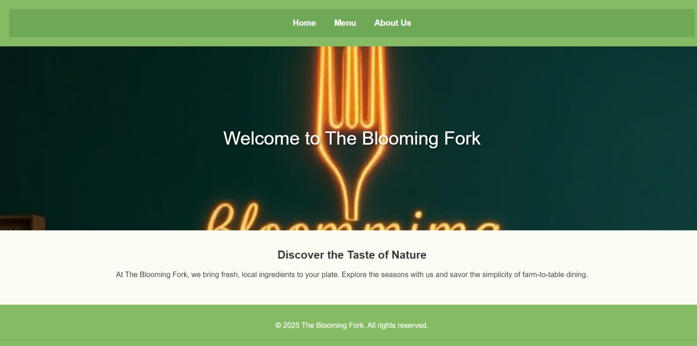

# Restaurant Page Project

This is a **Restaurant Page** project created as part of [The Odin Project](https://www.theodinproject.com/) JavaScript curriculum. The project focuses on using **JavaScript modules** and **Webpack** to build a multi-page dynamic website.

## Features

- **Dynamic Page Content**: All content is rendered dynamically using JavaScript and DOM manipulation.
- **Tabbed Navigation**: 
  - Home
  - Menu
  - Contact
- Modular code organization with **JavaScript ES6 modules**.
- Styled with CSS for a visually appealing design.
- Responsive layout for seamless usability on both desktop and mobile devices.

## Project Preview



Try the live version of the project here: [Live Preview](https://gonalgar.github.io/restaurant-page/)

## Technologies Used

- **HTML5**: Markup for basic structure and Webpack integration.
- **CSS3**: Styling for layout, navigation, and overall aesthetics.
- **JavaScript (ES6)**: Logic for rendering content and managing page interactions.
- **Webpack**: Used to bundle JavaScript modules and manage assets.

## Getting Started

To view or modify the project locally:

1. Clone this repository:
   ```bash
   git clone https://github.com/gonalgar/restaurant-page.git
2. Navigate to the project directory:
    ```bash
    cd restaurant-page
3. Install the necessary dependencies:
    ```bash
    npm install
4. Build the project using Webpack:
    ```bash
    npm run build
4. Open the dist/index.html file in your browser to view the app.

## What I Learned
- Using Webpack to bundle assets and JavaScript modules.
- Organizing JavaScript code into reusable modules.
- Dynamically generating page content using the DOM API.
- Implementing tabbed navigation with event listeners.
- Designing a clean and responsive layout.

## Acknowledgements
This project is part of [The Odin Project Intermediate JavaScript](https://www.theodinproject.com/paths/full-stack-javascript/courses/javascript) curriculum. It provided valuable experience in bundling assets with Webpack and writing modular JavaScript for dynamic web applications.

## License
This project is open-source and available under the MIT License.